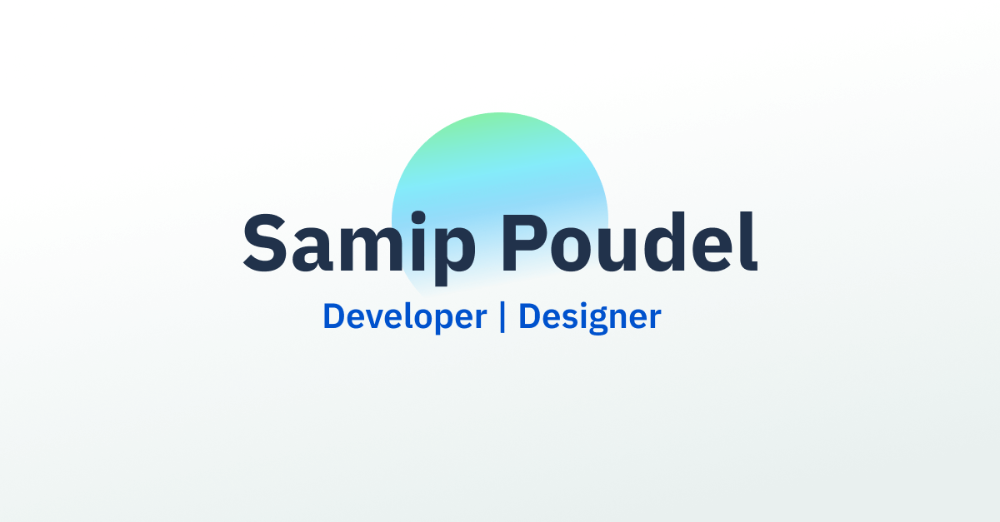

<a href="https://samippoudel.com.np/">
    
  </a>

  <h2 align="center">Samip Poudel's Portfolio Website</h2>

  <p align="center">Portfolio website with built-in blog</p>

  <p align="center">
    <a href="https://samippoudel.com.np">View Demo</a>
    ·
    <a href="https://github.com/SamipPoudel58/next-portfolio/issues">Report Bug</a>
    ·
    <a href="https://github.com/SamipPoudel58/next-portfolio/issues">Request Feature</a>
  </p>

> The previous version of this portfolio ( Made using Gatsby.js, Contentful and Sass) can be found [here](https://github.com/SamipPoudel58/portfolio).

## ⚙️ Tech Stack

- Next.js
- Sass + TailwindCSS
- MDX
- Typescript

## 🚀 Local Development

Run the project in your machine locally.

### Step 1: Clone the repository

Clone the repo locally using:

```sh
git clone https://github.com/SamipPoudel58/next-portfolio.git
```

### Step 2: Install Dependencies

Install dependencies in the root folder

```sh
cd next-portfolio
npm install
```

### Step 3: Run the server

```sh
npm run dev
```

## 🙏 Contributing

I'd love if you'd contribute to the project.

After cloning & setting up the local project you can push the changes to your github fork and make a pull request.

### Pushing the changes

```bash
git add .
git commit -m "feat: added new stuff"
git push YOUR_REPO_URL BRANCH_NAME
```
